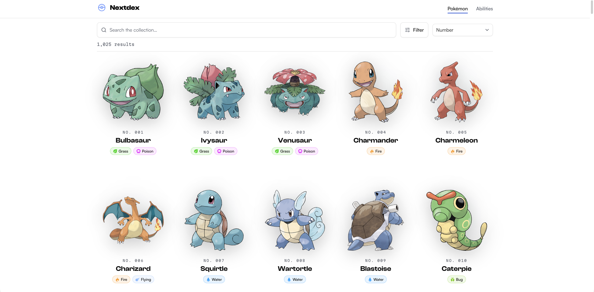
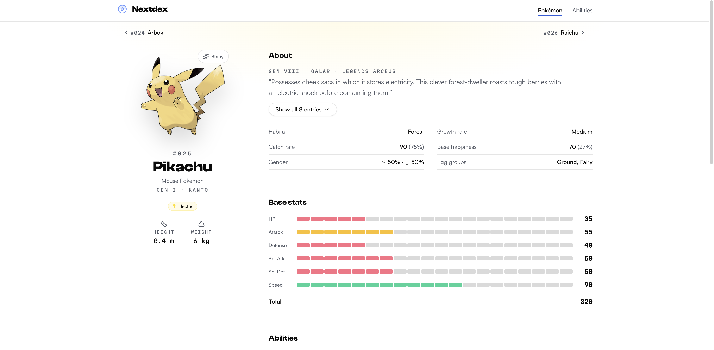
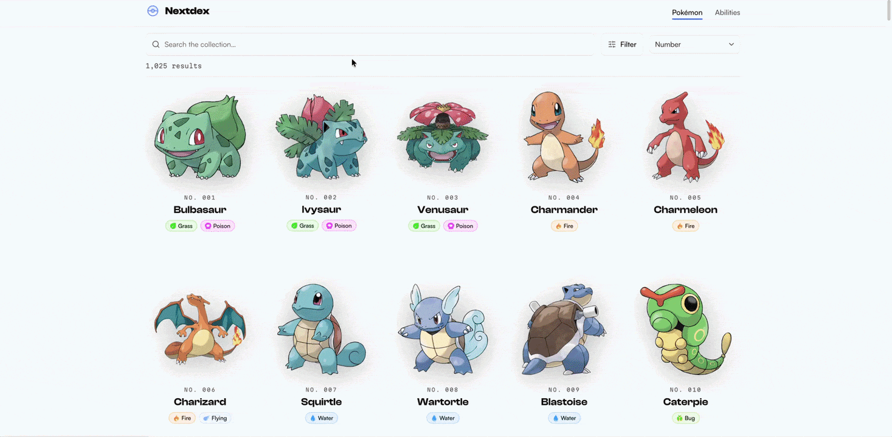
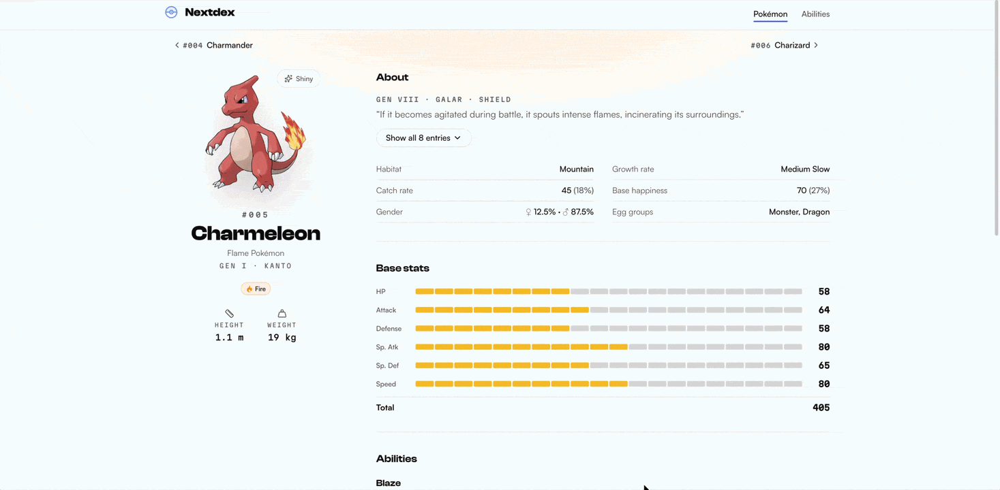

<div align="center">

# Nextdex

### The Collector's Gallery — a premium Pokédex.

Browse, search, and study every Pokémon and Ability in an art-first, gallery-grade interface.

[](https://nextdex-vert.vercel.app/)

[](https://nextjs.org/)
[](https://react.dev/)
[](https://www.typescriptlang.org/)
[](https://tailwindcss.com/)
[](https://zustand-demo.pmnd.rs/)

[](https://github.com/jojomanurung/Nextdex/actions/workflows/eslint.yml)
[](https://github.com/jojomanurung/Nextdex/actions/workflows/codeql.yml)

</div>

<div align="center">


</div>

---

## What is Nextdex?

Most Pokédex apps are data tables. **Nextdex is a gallery.** It treats the national dex like a curated collection — borderless artwork floating over typographic "SKU" labels, de-boxed editorial detail pages, and a single, restrained design language across every screen. It's built on live [PokeAPI](https://pokeapi.co/) data, but the goal was never just to display it — it was to make browsing Pokémon feel *premium*.

**→ Try it live: [nextdex-vert.vercel.app](https://nextdex-vert.vercel.app/)**

## ✨ Features

- **🖼️ Art-first gallery** — Pokémon browse as borderless tiles with official artwork, a monospace `NO. ###` label, and a type-colored hover aura.
- **🔍 Instant search, sort & filter** — search by name or dex number, sort four ways, and filter by type and generation — all resolved server-side, debounced, with no flash of empty results.
- **♾️ Seamless infinite scroll** — window-virtualized so a list of any length costs a fixed handful of DOM nodes; your scroll position and filters survive navigating to a detail page and back.
- **📄 "Specimen Dossier" detail pages** — a de-boxed editorial layout: a segmented stat HUD, defensive type matchups (×4 → ×0), branching evolution chains, a shiny-artwork toggle, and Pokédex flavor text grouped one entry per generation.
- **📖 Abilities catalogue** — a parallel browse family with its own typographic index and "Definition Entry" detail pages listing every Pokémon that can have each ability.
- **🌗 Device-synced theming** — solid, theme-aware light/dark surfaces that follow your OS, with no flash on load.
- **📱 Fully responsive** — from a two-column phone grid to a five-column desktop gallery.

<div align="center">


</div>

## 🛠️ Tech Stack

| Area | Choices |
| --- | --- |
| **Framework** | Next.js 16 (App Router), React 19 |
| **Language** | TypeScript |
| **Styling** | Tailwind CSS v4 (CSS-first), OKLCH design tokens |
| **UI** | shadcn on [Base UI](https://base-ui.com/), lucide icons |
| **State** | Zustand (event-driven, module-scoped stores) |
| **Virtualization** | TanStack Virtual (window virtualizer) |
| **Data** | [PokeAPI](https://pokeapi.co/) via [pokenode-ts](https://pokenode-ts.vercel.app/) |
| **Type system** | Clash Display · Satoshi · Martian Mono |
| **Hosting / analytics** | Vercel, Vercel Analytics + Speed Insights |

## 🏗️ How It's Built

The interesting parts, for anyone reading the source:

### Server-driven browsing
The client never filters or sorts a big in-memory list. Search, sort, and pagination all run **on the server** (`queryPokemon` / `queryAbilities`), which walks a lightweight full-dex index and resolves only the current page. The two browse families — Pokémon and Abilities — are built on the same machinery and mirror each other end to end. List pages SSR their first page and hydrate; every subsequent page is one request to `/api/pokemon` or `/api/ability`.

### Event-driven state, no data effects
List state (query, sort, filters, loaded results, pagination) lives in **module-scoped Zustand stores** created by a single `createBrowseStore<T>` factory. Every store action fires on a *user event* — not on a `useEffect` reacting to state — so the usual hazards (mount double-fetches, StrictMode double-invokes, effect-ordering races) are gone structurally rather than patched. Debounce is a closure timer inside `setQuery`; race-safety is a per-store `AbortController` + a monotonic sequence counter. Because the store lives outside React, list state survives `list ↔ detail` navigation for the session and resets on a full refresh — the whole scrolled list comes back with no refetch.

### Performance
- **Window virtualization** (TanStack Virtual) keeps the DOM bounded no matter how deep you scroll, with an SSR-correct CSS-grid fallback before hydration.
- **ISR** — list pages revalidate hourly, detail pages daily.
- **Unified upstream cache** — one shared PokeAPI client with a 1-hour response cache; detail fetches are parallelized and de-duplicated across metadata + render via React `cache()`.

### Design system
A device-synced light/dark palette in **OKLCH**, a three-face type system (Clash Display / Satoshi / Martian Mono), one fixed brand-blue accent, and the 18 type colors reserved to type chips and hover auras.

### Quality & SEO
Per-page metadata (Open Graph + Twitter cards) and Schema.org JSON-LD, generated favicon and OG defaults, keyboard-friendly and reduced-motion-aware interactions, and CI on every PR (ESLint + CodeQL). Types are verified with `tsc --noEmit`.

## 🚀 Getting Started

**Prerequisites:** Node.js 20+ and npm.

```bash
# 1. Clone
git clone https://github.com/jojomanurung/Nextdex.git
cd Nextdex

# 2. Install
npm install

# 3. Run the dev server
npm run dev
```

Open [http://localhost:3000](http://localhost:3000).

> **Note:** the build statically generates `/` and `/abilities`, so it fetches PokeAPI at build time and needs network access.

### Environment

| Variable | Purpose | Default |
| --- | --- | --- |
| `NEXT_PUBLIC_SITE_URL` | Absolute base URL for canonical / OG / Twitter tags | Vercel URL, else `http://localhost:3000` |

Optional locally — set it only if you want absolute metadata URLs. On Vercel it's derived automatically.

### Scripts

| Command | Description |
| --- | --- |
| `npm run dev` | Start the dev server on `http://localhost:3000` |
| `npm run build` | Production build |
| `npm start` | Serve the production build |
| `npm run lint` | Run ESLint |
| `npm run typecheck` | Type-check with `tsc --noEmit` (fast, no network) |

## 📁 Project Structure

```
src/
├── app/            # App Router: pages, API routes, layout, error/not-found
│   ├── pokemon/[name]/     # Pokémon detail ("Specimen Dossier")
│   ├── abilities/          # Abilities list + [name] detail ("Definition Entry")
│   └── api/                # /api/pokemon, /api/ability collection endpoints
├── components/     # home · abilities · detail · common · ui (shadcn/Base UI)
├── store/          # createBrowseStore factory + per-family Zustand stores
├── lib/            # PokeAPI data layer (list cores + detail aggregators)
├── interfaces/     # Shared data shapes
├── constant/       # Types, sort keys, pagination, site + Pokémon metadata
├── styles/         # globals.css (Tailwind v4 + design tokens)
└── fonts/          # Self-hosted Clash Display + Satoshi
```

## 🙏 Acknowledgements

- [PokeAPI](https://pokeapi.co/) — the open Pokémon data source powering everything here.
- Type faces: **Clash Display** & **Satoshi** ([Fontshare](https://www.fontshare.com/)), **Martian Mono** (Google Fonts).

> Nextdex is a non-commercial fan project. Pokémon and all related names are trademarks of © Nintendo, Game Freak, and The Pokémon Company. This project is not affiliated with or endorsed by them.

## 👤 Author

**Joshua Melvin**
[LinkedIn](https://www.linkedin.com/in/joshua-melvin/) · [GitHub](https://github.com/jojomanurung)

---

<div align="center">

If you like it, give it a ⭐ — and go [explore the collection](https://nextdex-vert.vercel.app/).

</div>
